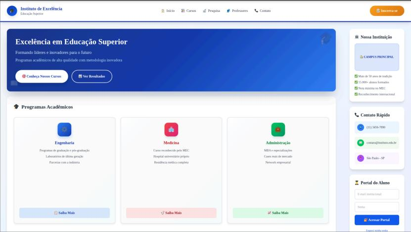
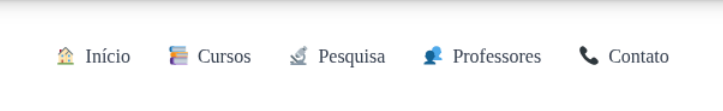
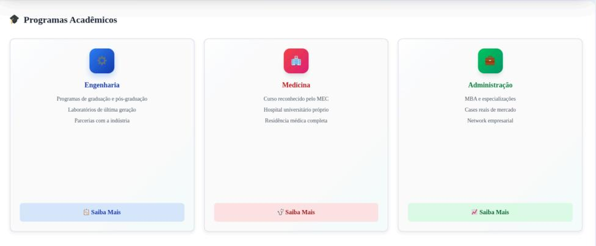
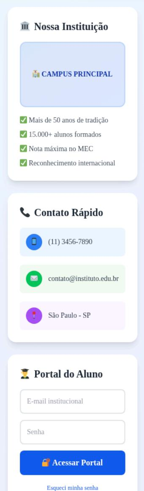

# Tutorial - Instituto de Excelência: Site Educacional

## 📋 Índice
1. [Wireframe](#wireframe)
2. [Processo de Ideação](#processo-de-ideação)
3. [Protótipos Iniciais](#protótipos-iniciais)
3. [Caráter Extensionista](#caráter-extensionista)
5. [Explicação do Código](#explicação-do-código)
6. [Conclusão e Aprendizados](#conclusão-e-aprendizados)

---

## Wireframe

### Wireframe:

Geral:



Nosso cabeçalho terão as seguintes opções:



- Início – Redireciona o usuário para a página principal;
- Cursos – Redireciona o usuário para os cursos disponíveis e o nível de conclusão de cada curso;
- Pesquisas – Pesquisas publicadas sobre dicas e benefícios dos estudos;
- Professores – Profissionais que serão responsáveis pelos conteúdos disponíveis;
- Contato – Página para entrar em contato com os responsáveis do site.

Aqui estarão os cursos em progresso (talvez coloquemos uma barra de progresso em cada
ícone):




Na lateral do site haverá algumas informações rápidas e links específicos e úteis:



## Processo de Ideação

### Conceito do Projeto

Visto o grande problema na educação no Brasil, resolvemos criar um site focado para
auxiliar crianças e adultos ao estudo de matérias acadêmicas básicas e superiores. Tudo
seria disponibilizado gratuitamente e teria uma interface simples e direta, para assim
qualquer tipo de pessoa conseguir acessar e compreender o funcionamento do site,
acreditamos que isso o torna um projeto extensionista.

- **Objetivo Principal**: Criar uma plataforma web informativa que apresente os cursos e professores
- **Público-Alvo**: Estudantes em busca de informações sobre cursos com um facil acesso
- **Proposta de Valor**: Facilitar o acesso à informação educacional.

### Metodologia de Desenvolvimento

O projeto seguiu uma abordagem estruturada:

1. **Análise de Requisitos**: Identificação das páginas necessárias (Home, Cursos, Professores, Contato, Formulário)
2. **Design de Interface**: Criação de wireframes baseados em nossa ideia
3. **Desenvolvimento**: Implementação usando HTML5 semântico, CSS3 e JavaScript vanilla
4. **Testes e Refinamento**: Validação de funcionalidades e correção de bugs

---

## Caráter Extensionista

### Impacto Social e Educacional

#### 1. Democratização do Acesso à Informação

- **Acessibilidade**: Site responsivo que funciona em dispositivos móveis, tablets e desktops
- **Clareza**: Informações organizadas de forma intuitiva e fácil de navegar
- **Inclusão**: Uso de HTML semântico que facilita a leitura por tecnologias assistivas

#### 2. Ponte entre Instituição e Comunidade

- **Transparência**: Apresentação clara dos cursos, corpo docente e infraestrutura
- **Comunicação Direta**: Múltiplos canais de contato (telefone, e-mail, WhatsApp)
- **Processo Simplificado**: Formulário de inscrição online que reduz barreiras de entrada

#### 3. Promoção da Educação

- **Visibilidade**: Destaque para diferentes áreas do conhecimento (Engenharia, Medicina, Administração)
- **Inspiração**: Apresentação de professores qualificados e resultados acadêmicos

#### 4. Desenvolvimento de Competências Digitais

- **Aprendizado Prático**: Projeto desenvolvido por estudantes aplicando conhecimentos de HTML, CSS e JavaScript
- **Trabalho Colaborativo**: Desenvolvimento em equipe promovendo soft skills
- **Resolução de Problemas**: Identificação e correção de bugs reais

---

## Explicação do Código

### Estrutura HTML5 Semântica

#### Por que HTML Semântico?
O projeto utiliza **HTML5 semântico** (sem uso de `<div>`) para:
- Melhorar a acessibilidade para leitores de tela
- Facilitar a manutenção do código
- Otimizar SEO (Search Engine Optimization)
- Seguir as melhores práticas modernas de desenvolvimento web

#### Elementos Semânticos Utilizados

<header>    Cabeçalho da página
  
<nav>       Navegação principal
  
<main>      Conteúdo principal
  
<section>   Seções de conteúdo
  
<article>   Conteúdo independente (cards)
  
<aside>     Conteúdo complementar (sidebar)
  
<footer>    Rodapé (em cards)
  
<figure>    Ícones e imagens
  
<address>   Informações de contato 


#### Exemplo Prático: Estrutura de um Card

```
<article class="programa-card">
  <header class="card-header">
    <figure class="card-icon blue">
      <span>⚙️</span>
    </figure>
    <h3>Engenharia</h3>
  </header>
  <ul class="card-features">
    <li>Programas de graduação e pós-graduação</li>
    <li>Laboratórios de última geração</li>
  </ul>
  <footer class="card-footer">
    <a href="engenharia.html" class="btn-saiba-mais blue">Saiba Mais</a>
  </footer>
</article>
```

**Explicação**:
- `<article>`: Define um conteúdo independente (o card)
- `<header>`: Cabeçalho do card com ícone e título
- `<figure>`: Container semântico para o ícone
- `<ul>`: Lista não ordenada de características

---

### CSS: Estilização e Animações

#### Sistema de Cores 

```
:root {
  --primary-blue: #2563eb;
  --dark-blue: #1e3a8a;
  --light-blue: #dbeafe;
  --red: #dc2626;
  --green: #16a34a;
  --orange: #f59e0b;
}
```

**Vantagens**:
- Fácil manutenção: alterar uma cor em um único lugar
- Consistência visual em todo o site
- Facilita a criação de temas alternativos

#### Animações CSS

##### 1. Fade In Up 

```
@keyframes fadeInUp {
  from {
    opacity: 0;
    transform: translateY(30px);
  }
  to {
    opacity: 1;
    transform: translateY(0);
  }
}

.fade-in-up {
  animation: fadeInUp 0.6s ease-out forwards;
}
```

**Como funciona**:
- Elemento começa invisível (`opacity: 0`) e 30px abaixo
- Gradualmente fica visível e move para posição original
- Duração: 0.6 segundos com easing suave

##### 2. Slide In Left (Entrada Lateral)

```
@keyframes slideInLeft {
  from {
    opacity: 0;
    transform: translateX(-30px);
  }
  to {
    opacity: 1;
    transform: translateX(0);
  }
}
```

**Uso**: Aplicado ao header e sidebar para criar sensação de profundidade

##### 3. Pulse (Pulsação)

```
@keyframes pulse {
  0%, 100% {
    transform: scale(1);
  }
  50% {
    transform: scale(1.05);
  }
}
```

**Uso**: Aplicado ao botão "Inscreva-se" para chamar atenção

#### Layout Responsivo com CSS Grid

```
body {
  display: grid;
  grid-template-columns: 1fr 300px;
  grid-template-areas:
    "header header"
    "main sidebar";
}

.main-header { grid-area: header; }
.main-content { grid-area: main; }
.sidebar { grid-area: sidebar; }
```

**Explicação**:
- Layout em duas colunas: conteúdo principal (1fr) e sidebar (300px)
- Header ocupa toda a largura
- Grid areas facilitam o reposicionamento em diferentes telas

#### Media Queries para Responsividade

```
@media (max-width: 1024px) {
  body {
    grid-template-columns: 1fr;
    grid-template-areas:
      "header"
      "main"
      "sidebar";
  }
}
```

---

### JavaScript: Interatividade e Validação

#### 1. Event Listener Principal

```
document.addEventListener("DOMContentLoaded", () => {
  console.log("[v0] Script carregado com sucesso")
  // Código executado após o DOM estar pronto
})
```

**Por que usar DOMContentLoaded?**
- Garante que todo o HTML foi carregado antes de executar o JavaScript
- Evita erros de elementos não encontrados
- Melhora a performance

#### 2. Validação de Formulários

```
const loginForms = document.querySelectorAll(".login-form")
loginForms.forEach((form) => {
  form.addEventListener("submit", function (e) {
    e.preventDefault() // Impede envio padrão
    const email = this.querySelector('input[type="email"]')?.value

    if (email && email.includes("@")) {
      alert(`Redirecionando para o portal com o email: ${email}`)
    } else {
      alert("Por favor, insira um email válido.")
    }
  })
})
```

**Explicação passo a passo**:
1. Seleciona todos os formulários com classe `.login-form`
2. Adiciona listener de submit para cada formulário
3. `e.preventDefault()` impede o envio padrão (que recarregaria a página)
4. Valida se o email contém "@"
5. Exibe mensagem apropriada

#### 3. Redirecionamento do Botão Inscreva-se

```
const btnInscricao = document.querySelectorAll(".btn-inscricao")
btnInscricao.forEach((btn) => {
  btn.addEventListener("click", () => {
    console.log("[v0] Inscrição button clicked")
    window.location.href = 'formulario.html'
  })
})
```

**Funcionalidade**: Redireciona para a página de formulário ao clicar

#### 4. Scroll Suave para Âncoras

```
const anchorLinks = document.querySelectorAll('a[href^="#"]')
anchorLinks.forEach((link) => {
  link.addEventListener("click", function (e) {
    const href = this.getAttribute("href")
    if (href !== "#") {
      e.preventDefault()
      const target = document.querySelector(href)
      if (target) {
        target.scrollIntoView({
          behavior: "smooth",
          block: "start",
        })
      }
    }
  })
})
```

**Resultado**: Links internos (#professores, #contato) rolam suavemente até a seção

#### 5. Intersection Observer para Animações

```
const observerOptions = {
  threshold: 0.1,
  rootMargin: "0px 0px -50px 0px",
}

const observer = new IntersectionObserver((entries) => {
  entries.forEach((entry, index) => {
    if (entry.isIntersecting) {
      setTimeout(() => {
        entry.target.classList.add("fade-in-up")
      }, index * 100) // Delay escalonado
      observer.unobserve(entry.target)
    }
  })
}, observerOptions)

const cards = document.querySelectorAll(".programa-card, .contact-card")
cards.forEach((card) => {
  observer.observe(card)
})
```

**Como funciona**:
1. **Intersection Observer**: API moderna que detecta quando elementos entram na viewport
2. **threshold: 0.1**: Ativa quando 10% do elemento está visível
3. **rootMargin**: Margem negativa de 50px na parte inferior (ativa antes)
4. **Delay escalonado**: Cada card anima 100ms após o anterior
5. **unobserve**: Remove observação após animar (performance)

**Vantagens sobre scroll events**:
- Melhor performance (não executa a cada pixel de scroll)
- Mais preciso
- Suportado nativamente pelos navegadores modernos

#### 6. Máscaras de Input (Formulário)

```
// Máscara de CPF
document.getElementById('cpf').addEventListener('input', function(e) {
  let value = e.target.value.replace(/\D/g, '') // Remove não-dígitos
  if (value.length <= 11) {
    value = value.replace(/(\d{3})(\d)/, '$1.$2')
    value = value.replace(/(\d{3})(\d)/, '$1.$2')
    value = value.replace(/(\d{3})(\d{1,2})$/, '$1-$2')
    e.target.value = value
  }
})

**Resultado**: Formata automaticamente para `000.000.000-00`

// Máscara de Telefone
document.getElementById('telefone').addEventListener('input', function(e) {
  let value = e.target.value.replace(/\D/g, '')
  if (value.length <= 11) {
    value = value.replace(/(\d{2})(\d)/, '($1) $2')
    value = value.replace(/(\d{5})(\d)/, '$1-$2')
    e.target.value = value
  }
})
```

**Resultado**: Formata automaticamente para `(11) 98888-7777`

---

### Estrutura de Arquivos

```
ProjetoWM/
├── index.html              # Página principal
├── cursos.html             # Lista de cursos
├── professores.html        # Corpo docente
├── contato.html            # Informações de contato
├── formulario.html         # Formulário de inscrição
├── resultados.html         # Projetos e resultados
├── engenharia.html         # Detalhes do curso
├── medicina.html           # Detalhes do curso
├── administracao.html      # Detalhes do curso
├── style.css               # Estilos globais
├── script.js               # JavaScript global
└── imagens/                # Recursos visuais
    ├── image.png
    ├── image-1.png
    ├── image-2.png
    └── image-3.png
```
---

## Conclusão e Aprendizados

### Aprendizados Técnicos

#### 1. HTML5 Semântico
- **Aprendizado**: Compreensão profunda da importância de usar elementos semânticos corretos
- **Desafio**: Evitar o uso de `<div>` e encontrar alternativas semânticas apropriadas
- **Resultado**: Código mais acessível, manutenível e otimizado para SEO

#### 2. CSS Moderno
- **Aprendizado**: Domínio de CSS Grid, Flexbox e CSS Variables
- **Desafio**: Criar animações suaves e responsivas sem bibliotecas externas
- **Resultado**: Site visualmente atraente com excelente performance

#### 3. JavaScript Vanilla
- **Aprendizado**: Manipulação do DOM, event listeners e APIs modernas (Intersection Observer)
- **Desafio**: Implementar validações e animações sem frameworks
- **Resultado**: Código limpo, performático e fácil de entender

#### 4. Design Responsivo
- **Aprendizado**: Técnicas de mobile-first e media queries
- **Desafio**: Garantir boa experiência em todos os tamanhos de tela
- **Resultado**: Site totalmente responsivo e acessível

### Aprendizados de Processo

#### 1. Trabalho em Equipe
- Divisão de tarefas entre membros do grupo
- Comunicação efetiva para resolver problemas
- Revisão de código colaborativa
- Uso da ferramenta git e sua integração com vscode

#### 2. Debugging e Resolução de Problemas
- Identificação sistemática de bugs (professores não aparecendo, botões não funcionando)
- Uso de console.log para rastreamento
- Testes em diferentes navegadores e dispositivos

#### 3. Documentação
- Importância de comentários claros no código
- Criação de documentação técnica (este tutorial)
- Registro do processo de desenvolvimento

### Desafios Superados

1. **Botão "Fale Conosco" não redirecionava**: Corrigido alterando `href="#contato"` para `href="contato.html"`
2. **Página de professores vazia**: Adicionado `script.js` que estava faltando
3. **Animações não funcionavam**: Implementado Intersection Observer corretamente
4. **Formulário de inscrição inexistente**: Criado `formulario.html` completo com validações
5. **Botão "Inscreva-se" sem ação**: Adicionado redirecionamento via JavaScript

### Impacto do Projeto

#### Técnico
- Consolidação de conhecimentos em desenvolvimento web front-end
- Experiência prática com padrões modernos de HTML, CSS e JavaScript
- Compreensão de acessibilidade e usabilidade

#### Pessoal
- Desenvolvimento de habilidades de resolução de problemas
- Aprimoramento da capacidade de trabalho em equipe
- Crescimento da confiança em programação

#### Social (Extensionista)
- Criação de ferramenta que facilita acesso à educação
- Contribuição para democratização da informação
- Aplicação prática de conhecimentos para benefício da comunidade

### Próximos Passos

- Adicionar React 

---

## Referências e Recursos

### Tecnologias Utilizadas
- **HTML5**: Estrutura semântica
- **CSS3**: Estilização e animações
- **JavaScript (ES6+)**: Interatividade
- **Git**: Controle de versão

### Padrões Seguidos
- **W3C**: Validação HTML e CSS
- **Mobile**: Design responsivo

### Ferramentas de Desenvolvimento
- Editor de código: VS Code
- Navegadores modernos
- DevTools para debugging
- Git para versionamento
